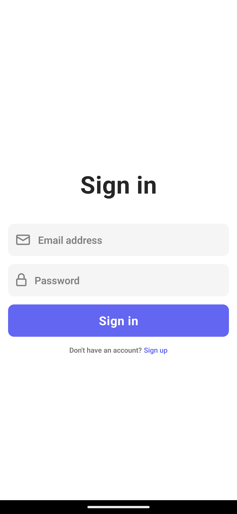
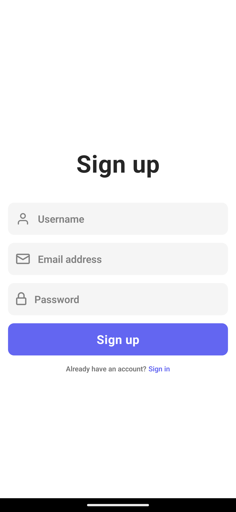
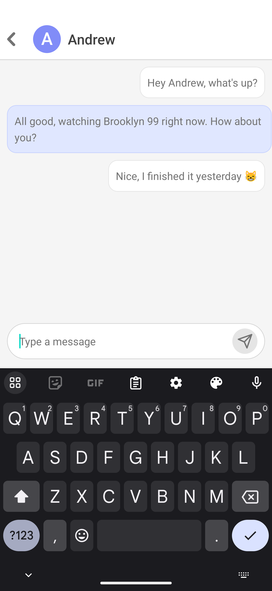

# Chatty

Chatty is a simple chat application that uses Firebase for authentication and handling chat messages.
This app includes a sign in, sign up screen, a home screen displaying a list of chats, and a chat screen where users can view all messages.

## Screenshots

<p align="middle">
   <h2>Authentication screens</h2>
   <div style="display: flex; gap: 4px">
      
          
   </div>
   
   <br />
   
   <h2>Home screen</h2>
   <div style="display: flex; gap: 4px">
      
          
   </div>
   
   <br />

   <h2>Chat screen</h2>
   
</p>

## Features

- **Sign In**: Users can sign in with their email and password.
- **Sign Up**: New users can create an account by signing up with their email and password and provide a username.
- **Home Screen**: Displays a list of chats with the last message from each chat and date-time when message was sent.
- **Chat Screen**: Users can view all messages in a chat and send new messages.

## Installation

1. Clone the repository:

   ```sh
   git clone https://github.com/rkonde/QuizFlip.git
   cd QuizFlip
   ```

2. Install dependencies:

   ```sh
   npm install
   ```

3. Setup Firebase:

- Go to Firebase Console
- Create a new project
- Enable Email/Password authentication in the Authentication section
- Create a Firestore database

4. Replace firebase configuration with your keys in .env file:

   ```sh
   const firebaseConfig = {
      apiKey: process.env.EXPO_PUBLIC_FIREBASE_API_KEY,
      authDomain: process.env.EXPO_PUBLIC_FIREBASE_AUTH_DOMAIN,
      projectId: process.env.EXPO_PUBLIC_FIREBASE_PROJECT_ID,
      storageBucket: process.env.EXPO_PUBLIC_FIREBASE_STORAGE_BUCKET,
      messagingSenderId: process.env.EXPO_PUBLIC_FIREBASE_MESSAGING_SENDER_ID,
      appId: process.env.EXPO_PUBLIC_FIREBASE_APP_ID,
   };
   ```

5. Run the app:

   ```sh
   npm start
   ```
